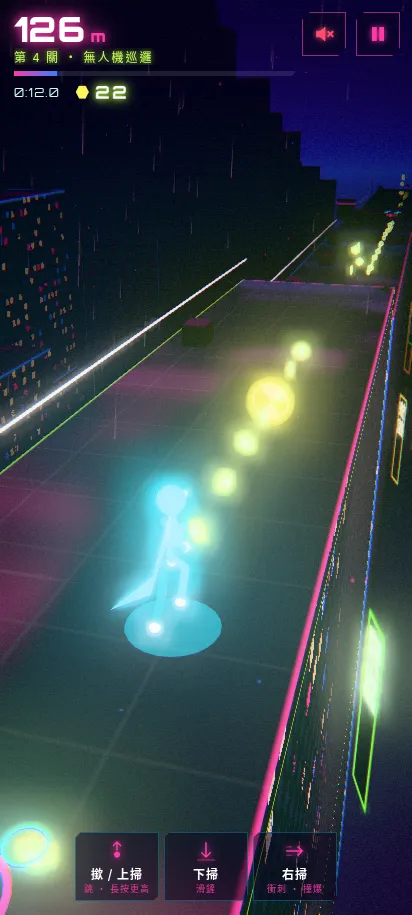
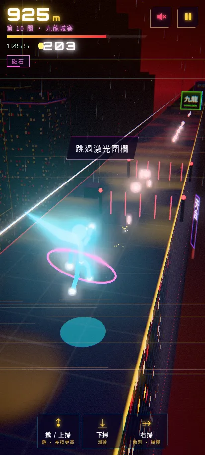
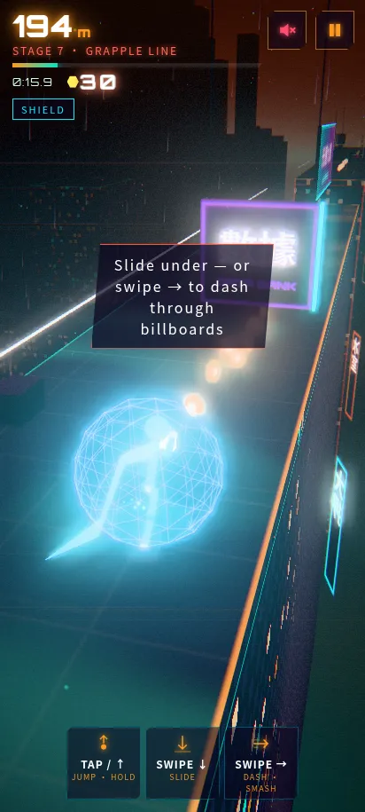
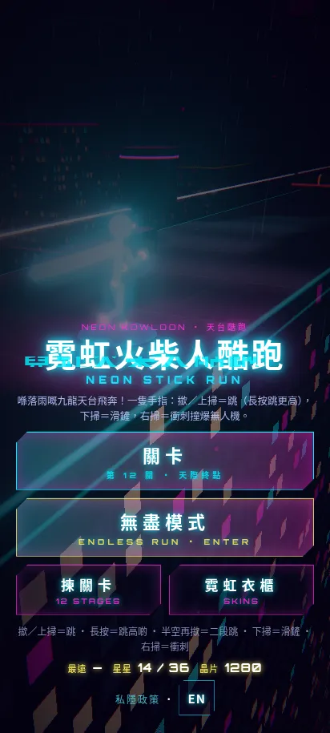
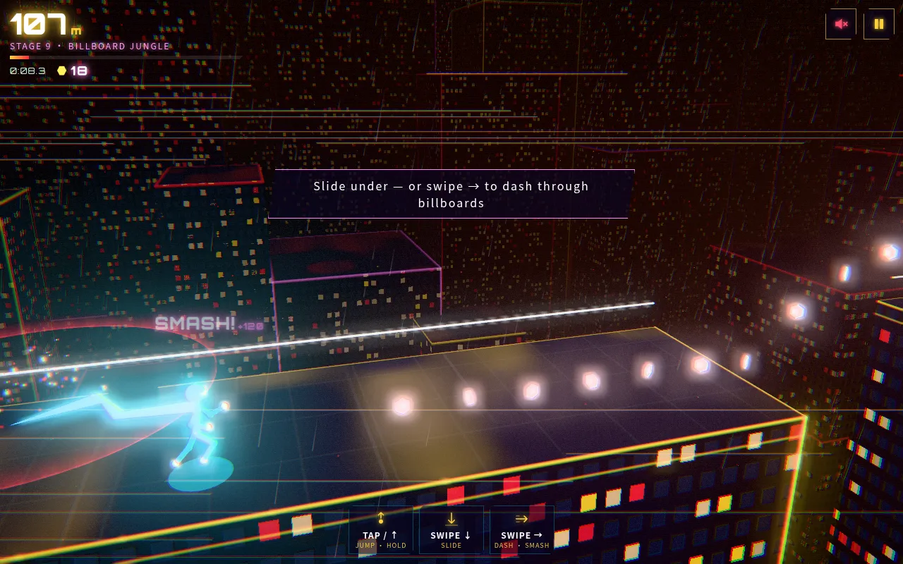
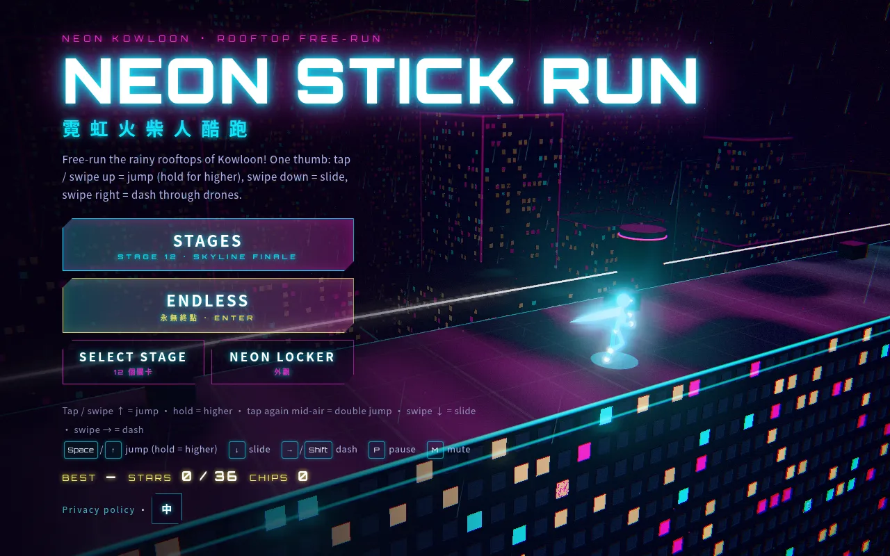

# 霓虹火柴人酷跑 NEON STICK RUN

> 單手 3D 天台酷跑 · one-thumb 3D rooftop parkour · 12 關 + 無盡模式 · Three.js · 手機優先 mobile-first

**試玩 Play:** https://fung2222.github.io/neon-stick-run/ · **自動示範 Demo:** https://fung2222.github.io/neon-stick-run/?demo=1

<p>   </p>
<p> </p>

## 玩法 How to play
一個發光火柴人喺落雨嘅九龍天台夜空飛奔。佢會自己向前跑，你只需要一隻手指：

| 手勢 Gesture | 動作 Move |
|---|---|
| **撳** / **上掃** TAP / SWIPE ↑ | 跳；**長按**跳得更高；半空再撳 = **二段跳**（空翻） |
| **下掃** SWIPE ↓ | 滑鏟穿過喉管同廣告牌；半空下掃 = 急降落地再滑鏟 |
| **右掃** SWIPE → | 衝刺 / 空中飛踢，可以**撞爆無人機**同廣告牌 |
| 自動 auto | 矮箱自動**跨越**；跳向廣告牆會**走壁**（撳 = 蹬牆跳）；跳近鈎點會**擺盪**（撳 = 提早放手） |

障礙：天台罅隙、矮喉管、激光圍欄（有啲會閃）、保安無人機、會崩塌嘅棚架、廣告牌。道具：數據晶片（貨幣）、磁石、護盾、慢鏡。

- **關卡模式**：12 個 60–120 秒嘅短關卡，難度逐步上升，每關 1–3 粒星（★ 完成 · ★★／★★★ 晶片達到該關目標，★★★ 仲要冇復活；目標按關卡設定，喺結果畫面顯示）。
- **無盡模式**：程式生成，速度不斷上升（有上限），每 500 米一個里程碑（+25 晶片、換區域顏色），記錄最遠距離。永遠冇終點。
- **霓虹衣櫃**：用晶片買純裝飾嘅霓虹顏色同光軌（唔影響平衡）。
- 失手可以**原地復活**一次（App 版睇獎勵廣告；網頁版免費）。

## 語言 Language
**繁體中文（香港）** / **English**，主畫面或暫停畫面撳「EN／中」切換，所有 CYBER 遊戲共用（`localStorage cyber.lang`）。網址 `?lang=en` / `?lang=zh` 亦可。

## English
**NEON STICK RUN** is a one-thumb 3D cyberpunk parkour runner. A glowing stickman free-runs across rainy Kowloon rooftops at night: **tap / swipe up** to jump (hold = higher, tap again = double jump), **swipe down** to slide, **swipe right** to dash and smash drones. Vaults, wall-runs and grapple swings trigger automatically when you jump at them. 12 short stages (60–120 s, 1–3 stars) plus a never-ending endless run with rising speed and a distance record. Spend data chips on cosmetic neon colours and trails. Bilingual with an in-game toggle.

## 鍵盤 Keyboard
`Space` / `↑` / `W` 跳（按住更高）· `↓` / `S` 滑鏟 · `→` / `D` / `Shift` 衝刺 · `P` / `Esc` 暫停 · `M` 靜音 · `Enter` 確認

## 網址參數 URL flags
`?demo=1` 自動示範（`&level=N`、`&mode=endless`）· `?lang=en|zh` · `?fps=1` · `?quality=low` · `?adsim=1` · `?reset=1` · `?mute=1`

## 技術 Tech
Three.js + [cyber-kit](https://github.com/fung2222/cyber-kit) v0.3.0（`vendor/cyber-kit/`），冇 build step。固定步長（1/90 s）純模擬（`js/sim.js`，可以喺 Node 測試）、程序生成天台、程序動畫火柴人骨架、全部音效即時合成。所有美術、文字同音效都係原創。

## 開發 Development
```bash
cd .. && python3 -m http.server 18950     # http://127.0.0.1:18950/neon-stick-run/
node neon-stick-run/tests/sim.test.mjs
python neon-stick-run/tests/smoke.py
python neon-stick-run/tests/shots.py   # live 12-stage playtest + zh/en screenshots
```
文件：[docs/HANDOFF.md](docs/HANDOFF.md) · [privacy.html](privacy.html)
